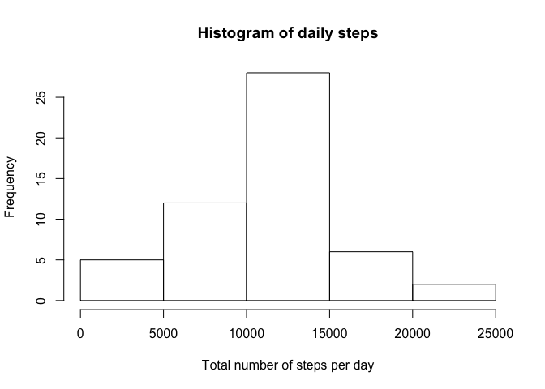
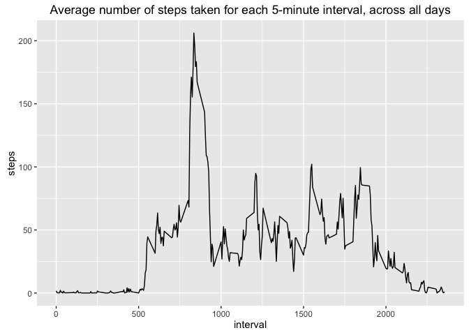
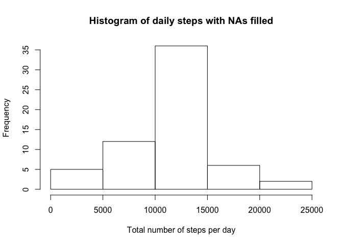

# Reproducible Research: Peer Assessment 1
## Loading and preprocessing the data

```r
setwd("~/Documents/_Learn/Coursera/data-science/05_ReproducibleResearch/RepData_PeerAssessment1")
library(data.table)
library(ggplot2)
suppressPackageStartupMessages(library(dplyr, quietly=TRUE))
d <- data.table(read.csv("activity.csv"))
```

## What is mean total number of steps taken per day?

```r
# 1) Calculate the number of steps taken per day
dailySteps <- aggregate(steps~date, data = d, FUN = sum)
# 2) Make a histogram of the total number of steps taken each day
hist(dailySteps$steps, main = "Histogram of daily steps", xlab = "Total number of steps per day")
```



```r
# 3) Calculate and report the mean and median of the total number of steps taken per day
meanDailySteps <- mean(dailySteps$steps)
paste("Mean of daily number of steps is:", meanDailySteps, sep = "")
```

```
## [1] "Mean of daily number of steps is:10766.1886792453"
```

```r
medianDailySteps <- median(dailySteps$steps)
paste("Median of daily number of steps is:", medianDailySteps, sep = "")
```

```
## [1] "Median of daily number of steps is:10765"
```

## What is the average daily activity pattern?

```r
# 1) Make a time series plot of the 5-minute interval and the average number of steps taken, averaged across all days
intervalSteps <- aggregate(steps~interval, data = d, FUN = mean)
qplot(interval, steps, data = intervalSteps, geom = "line", main = "Average number of steps taken for each 5-minute interval, across all days")
```



```r
# 2) Which 5-minute interval, on average across all the days in the dataset, contains the maximum number of steps?
maxSteps <- max(intervalSteps$steps)
mostActiveInterval <- intervalSteps[intervalSteps$steps == maxSteps, 1]
paste("Interval with the maximum number of steps, on average across all days:", mostActiveInterval, sep = " ")
```

```
## [1] "Interval with the maximum number of steps, on average across all days: 835"
```


## Imputing missing values

```r
# 1) Calculate and report the total number of missing values in the dataset (i.e. the total number of rows with 𝙽𝙰s)
incompleteRows <- dim(d)[1] - sum(complete.cases(d))
paste("Total number of rows with at least one missing value:", incompleteRows, sep = " ")
```

```
## [1] "Total number of rows with at least one missing value: 2304"
```

```r
# 2) Strategy for filling in the missing values
print("Replace NAs with the mean for that 5-minute interval")
```

```
## [1] "Replace NAs with the mean for that 5-minute interval"
```

```r
# 3) Create a new dataset that is equal to the original dataset but with the missing data filled in.
merged <- merge(d, intervalSteps, by.x = "interval", by.y = "interval", all=TRUE)
dnew <- merged %>% mutate(newSteps = ifelse(!is.na(steps.x), steps.x, steps.y ))
dnew <- select(dnew, date, interval, steps = newSteps)

# 4) Make a histogram of the total number of steps taken each day and calculate and report the mean and median total number of steps taken per day. Do these values differ from the estimates from the first part of the assignment? What is the impact of imputing missing data on the estimates of the total daily number of steps?

dailyStepsNew <- aggregate(steps~date, data = dnew, FUN = sum)
hist(dailyStepsNew$steps, main = "Histogram of daily steps with NAs filled", xlab = "Total number of steps per day")
```



```r
meanDailyStepsNew <- mean(dailyStepsNew$steps)
paste("Mean of daily number of steps is:", meanDailyStepsNew, sep = "")
```

```
## [1] "Mean of daily number of steps is:10766.1886792453"
```

```r
medianDailyStepsNew <- median(dailyStepsNew$steps)
paste("Median of daily number of steps is:", medianDailyStepsNew, sep = "")
```

```
## [1] "Median of daily number of steps is:10766.1886792453"
```

```r
meanChange <- 100*(meanDailyStepsNew / meanDailySteps) - 100
medianChange <- 100*(medianDailyStepsNew / medianDailySteps) - 100
medianChange
```

```
## [1] 0.01104207
```

```r
paste("Filling NAs determines a change of ", round(meanChange, 4), "% in the mean and ", round(medianChange,4), "% in the median", sep = "")
```

```
## [1] "Filling NAs determines a change of 0% in the mean and 0.011% in the median"
```

## Are there differences in activity patterns between weekdays and weekends?

```r
dw <- mutate(dnew, wkday = weekdays(as.Date(date, format = "%Y-%m-%d")), daytype = ifelse(is.element(wkday, c("Saturday", "Sunday")), "weekend", "weekday")) 
dw$daytype <- factor(dw$daytype)
intervalStepsDw <- aggregate(steps~interval + daytype, data = dw, FUN = mean)
qplot(interval, steps, data = intervalStepsDw, geom = "line", facets = daytype~.)
```


```r
wdi <- filter(intervalStepsDw, daytype == "weekday")
wei <- filter(intervalStepsDw, daytype == "weekend")
paste("The correlation between weekdays and weekends in terms of average number of steps by interval is ", round(cor(wei$steps, wdi$steps), 4), sep = "")
```

```
## [1] "The correlation between weekdays and weekends in terms of average number of steps by interval is 0.6242"
```

```r
paste("The average number of steps per day during weekends is ", round(sum(wei$steps) / sum(wdi$steps), 2), "x vs weekdays", sep = "")
```

```
## [1] "The average number of steps per day during weekends is 1.19x vs weekdays"
```
